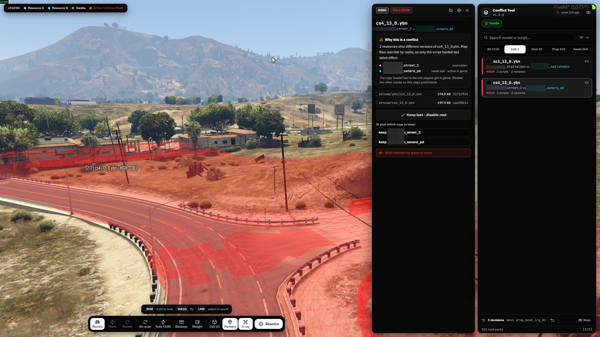

# fivem_conflicttool



In-game map conflict scanner and resolver for FiveM. It scans every started resource for conflicting `.ymap`, `.ytyp`, `.ybn`, `.ydr` and `.ydd` files, shows each conflict in the world, and resolves them with keep, move or remove decisions. Standalone, no framework required.

## Features

- **Full server scan**: lists all started resources, reads their folders, and hashes and parses every map file. RSC7 parsing of ymap, ytyp and ybn runs on the server.
- **Conflict types**: duplicate assets, prop differences (removed, moved, re-modelled), double placements, overlapping box occluders, duplicate collision files, stale LOD light overrides.
- **Auto resolve**: queues the safe fixes in one click, such as identical duplicate copies and double-placed props.
- **Manual resolve**: keep, move or remove each conflict, with in-world preview of both sides.
- **World markers**: every conflict is marked with a color-coded beam, and selecting one in the list flies the camera to it.
- **In-game editing**: move and rotate objects with the native gizmo, with grid snap, snap to ground and numeric transform inputs.
- **Collision and occluder display**: collision triangles of conflicting `.ybn` files draw in red, box occluders in amber.
- **X-ray**: draws markers, meshes and boxes through walls and terrain.
- **Streaming weight**: per-resource map asset size ranking, with a warning for files over 16 MB that may fail to stream.
- **Undo and restore**: decisions can be undone with Ctrl+Z, and Apply moves losing files into timestamped backup bundles that can be restored with sha1 verification.
- **Persistent decisions**: entity decisions apply at runtime for every player on spawn, and file decisions persist because the files are moved.
- **Remappable keys**: every bind is a FiveM key mapping and can be changed per player.

## Install

1. Download the latest `fivem_conflicttool-vX.Y.Z.zip` from [Releases](https://github.com/kkMihai/fivem_conflicttool/releases) and unzip it into your `resources` folder. The zip ships a built UI and is ready to start.

   To use a source checkout instead, build the UI first:

   ```
   git clone https://github.com/kkMihai/fivem_conflicttool
   cd fivem_conflicttool/web
   npm install
   npm run build
   ```

2. Add to `server.cfg`:

   ```
   ensure fivem_conflicttool
   add_ace group.admin fivem_conflicttool allow
   add_unsafe_child_process_permission fivem_conflicttool
   ```

3. Restart the server. Permissions are read at boot only.

4. Join the server as an admin and run `/conflicttool`.

## Permissions

Moving duplicate files across resources requires a filesystem grant. Either of these works:

- `add_unsafe_child_process_permission fivem_conflicttool`, which covers every resource in one line.
- `add_filesystem_permission fivem_conflicttool write <resource>` lines. Every scan writes a ready-made list to `fivem_conflicttool/data/fs-permissions.cfg`, which can be loaded with `exec ./resources/[standalone]/fivem_conflicttool/data/fs-permissions.cfg`. Run one scan, then restart so the grants load.

Without a grant, scanning, previewing and entity decisions still work, and only file moves are blocked. The Apply dialog reports it when that happens.

## Controls

| Key                     | Action                                   |
| ----------------------- | ---------------------------------------- |
| Hold RMB                | Look around                              |
| WASD + E/Q + Shift/Ctrl | Fly the freecam                          |
| LMB                     | Select a marked object or drag the gizmo |
| Tab                     | Next conflict                            |
| K / R                   | Keep or remove the selected conflict     |
| 1 / 2 / 3               | Review, move or rotate mode              |
| G                       | Toggle grid snap                         |
| F                       | Snap object to ground                    |
| Enter                   | Finish transform                         |
| Ctrl+Z                  | Undo last decision                       |
| H                       | Hide or show the UI                      |

The UI and the world are both live: the cursor drives the interface while it is over a panel, and the camera and gizmo while it is over the world. Typing in a field pauses game keys.

Binds are remappable in FiveM Settings, under Key Bindings, FiveM. Key mappings register on first connect, so reconnect once if a key does not respond after installing or updating.

## Usage

1. Run **Scan** to index every started resource.
2. Pick a conflict from the list, or click a marked object in the world.
3. Decide with **Keep**, **Move** or **Remove**, or use **Auto** for the safe cases.
4. Run **Resolve** to apply the queued decisions.

Entity decisions apply live for everyone. File moves take effect after a server restart. **Backups** lists every apply bundle with a restore button, and **Weight** ranks resources by streaming size.

## Vanilla file index (optional)

With `server/data/vanilla-files.json.gz` present, conflicts that override base-game files are labelled as vanilla overrides. The index is a list of base-game file names, generated from an unmodified GTA V installation:

```
node tools/build-vanilla-index.mjs my-vanilla-file-list.txt
```

The file list can be exported with CodeWalker's RPF explorer or OpenIV. Only names are stored, and no game data is redistributed. Without the index everything else works the same.

## Where decisions are stored

- Entity decisions (remove and move) are stored in `data/decisions.json` and enforced at runtime with `CreateModelHide` plus a local replacement object for moves. No files are changed.
- Asset decisions (disabling a losing duplicate) move the file into `data/backups/<timestamp>/<resource>/<path>` after a sha1-verified copy. Each bundle has a `manifest.json`, and Restore copies the files back and skips files that changed since the bundle was made.

## Developer tools

```
node tools/verify-parser.mjs <file.ymap|ytyp|ybn> [--full]
node tools/test-scan.mjs <path-to-resources-folder>
node tools/test-apply.mjs
```

`test-scan.mjs` runs the scan pipeline against a resources folder outside FiveM.

## Support

If this tool saved you some pain, you can support it on [Ko-fi](https://ko-fi.com/kkmihai).

## License

GPL-3.0. See [LICENSE](LICENSE). This tool can be used, studied, modified and redistributed, including commercially, and any distributed modified version must stay open source under the same license.
